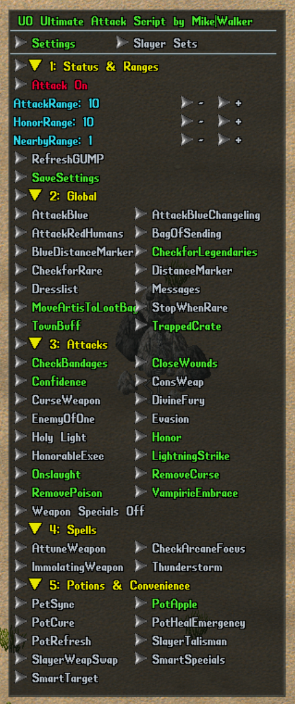

# UO Ultimate Dexxer Attack Script

By Mike|Walker

An all-in-one Razor Enhanced combat script for melee, Sampire, Ninja, Archer, Thrower, pet and summon templates. It was mainly tested on UOAlive, so some spell names, item properties or context-menu entries may need adjustment on other shards.

## Requirements

- Razor Enhanced 0.8.2.215 or newer with the corrected skill names.
- `AttackScript_MikeWalker.py` and `AttackScript_MikeWalker_GUMP.py` stored in the same script folder.
- The required skills, mana, items and expansions for the options you enable.

## Setup

1. Add both Python files to the Razor Enhanced Scripts list.
2. Start `AttackScript_MikeWalker.py` first.
3. Set `AttackScript_MikeWalker_GUMP.py` to Loop mode and start it.
4. Configure the options in the GUMP and press `SaveSettings`.

The attack script loads the saved settings the next time it starts. The GUMP only needs to run when you want to view or change those settings. `Attack Off` pauses automatic combat immediately.

## Character profiles

Settings are stored separately for each character, using the character serial in the file name:

- `AttackScript_settings_<serial>.json`
- `AttackScript_SlayerSets_<serial>.json`

This includes combat options, ranges, loot-bag serial, dress-list name, targeted ignores and slayer registrations. Old shared settings files are imported into the character profile when possible.

The GUMP hides options when the character does not meet their skill requirements. Changing characters therefore gives each character its own settings and its own available controls.

## Targeting and normal combat

- `AttackRange` controls how far away a mobile may be before the script considers it a target.
- `NearbyRange` controls the single-target and multi-target combat logic. It can be set wider than melee range; Momentum Strike can hit separated targets.
- `HonorRange` controls the maximum distance for Honor attempts.
- The script can attack the nearest target, favor a low-health target in a melee group, prioritize changelings, or use the optional smart-target scoring.
- Blue mobiles and red humans are excluded by default. Both filters can be changed in the GUMP, but enabling them can attack players or other unintended targets.
- Distance markers show whether the selected target is within the configured combat range.
- Pet Sync sends `all kill` when the selected target changes without repeating the command on every loop.

## Weapon abilities

The script recognizes the equipped weapon and selects its configured single-target or multi-target ability. Weapon abilities are re-armed after they are consumed so fast weapons can use them on successive swings. The three-second repeated-special mana penalty is included when checking whether enough mana is available; it does not impose a three-second attack delay.

- Single target: uses the configured primary or secondary ability. Optional Smart Specials can favor Mortal Strike, Paralyzing Blow, Concussion Blow or Armor Ignore for selected targets.
- Multiple targets: uses the configured group ability, normally Whirlwind when the weapon supports it.
- With weapon specials enabled, Lightning Strike is the low-mana single-target fallback and Momentum Strike is the low-mana multi-target fallback.
- `Weapon Specials Off`: disables primary and secondary weapon abilities. Lightning Strike becomes the normal enabled single-target move; Focus Attack, Death Strike, Onslaught and other spell-based moves still work.
- A readied weapon ability is not overwritten by Lightning Strike, Momentum Strike or another combat move.

Available combat options also include Honor, Enemy of One, Divine Fury, Consecrate Weapon, Holy Light, Counter Attack, Confidence, Evasion, Onslaught, Honorable Execution, Curse Weapon and Playing the Odds. Spellweaving support includes Arcane Focus, Summon Fey, Immolating Weapon, Attune Weapon and Thunderstorm.

## Ninjitsu

- `Mirror Image` casts only when an attackable mobile is within `AttackRange`, the character is not mounted and fewer than three follower slots are occupied.
- `Release Mirror` releases one verified Mirror Image when exactly four follower slots are occupied. It only releases an image while an attackable mobile is nearby, because releasing one without a target can cause bleed damage on UOAlive.
- When Mirror Image is enabled, Holy Light waits until three follower slots are occupied. Holy Light also requires at least three enemies within three tiles.
- `White Tiger Form` maintains the Ninjitsu mastery form when the character has 120 Ninjitsu and 120 Stealth. Casting the form dismounts the character.
- `Death Strike` and `Focus Attack` replace the normal weapon-ability rotation. They are mutually exclusive with each other and with the Backstab loop.

### Shadow Strike and Backstab

The optional Backstab loop keeps one target locked and uses this sequence:

1. Arm and land Shadow Strike.
2. Take one Stealth step while remaining beside the target.
3. Arm and attempt Backstab.
4. Use normal combat and the weapon's other useful ability during the five-second Backstab lock.
5. Stop filler abilities for the final three seconds, then start the next cycle.

The loop reserves mana for the next hiding move and Backstab. Whirlwind is only used as filler when multiple enemies are nearby. Egg Bombs and Smoke Bombs can be enabled as a hiding fallback if Shadow Strike is unavailable or misses. The normal combat loop is used whenever Backstab mode is disabled.

## Blood Oath

Blood Oath handling takes priority over normal combat:

- The script warns the player and leaves War mode.
- If Enchanted Apples are enabled and an apple is in the backpack, it uses one with a 60-second cooldown.
- Apples are used only for Blood Oath, not for other curses.
- If the apple is missing, cooling down or unsuccessful, the script attempts Remove Curse when enabled.
- While Blood Oath remains active, the only permitted attack is Whirlwind with more than two attackable mobiles within `AttackRange`. Other weapon abilities and normal single-target attacks are cleared or blocked.

## Slayer sets

The `Slayer Sets` tab manages per-character weapons and talismans for Undead, Repond, Arachnid, Reptile, Demon, Elemental, Fey and Eodon targets.

- Target an item to register it as a weapon or talisman.
- Enable automatic weapon swapping, talisman swapping or both.
- Select a registered item manually to equip it and place the current target group on hold.
- Hold mode ends when the target group changes, returning control to automatic swapping.
- A neutral `none` entry can restore a default weapon or talisman when no slayer group matches.

## Healing, defense and supplies

- Automatic Greater Refresh, Greater Cure and optional emergency Greater Heal potions use their own cooldowns and configurable thresholds.
- Remove Poison, Remove Curse and Close Wounds are normally used when no enemy is within six tiles. Blood Oath has its own Remove Curse handling.
- Confidence, Evasion, Counter Attack, Curse Weapon and other defensive actions can be enabled separately.
- A trapped crate can break Paralyze. The script also handles the Binding Bracelet and clears stuck target cursors.
- Bandage, arrow, quiver, Vampiric Embrace and town-buff checks warn when attention is needed.
- An optional Razor Enhanced dress list can be maintained. Save the exact Dress/Arm list name in the character profile.

## Loot and backpack handling

- `MoveArtisToLootBag` moves the artifacts listed in the script into a selected bag every ten seconds. Enabling it asks you to target a bag inside the backpack. If the saved bag cannot be found, the script asks for a new one and saves it to the character profile.
- Chest of Heirlooms items are dropped from the backpack onto a nearby ground tile every ten seconds.
- Bag of Sending support sends gold to the bank when the character is close to the weight limit and warns about missing bags or low charges.

## Safety and ignored targets

- Common animals and summons are ignored by default. Character-specific mobile names, summon names and serials can also be stored in the settings file.
- `Ignore Target` permanently ignores one targeted mobile for the current character. `Unignore Target` removes it from the saved ignore list.
- Rare-mob detection can mark a rare and optionally stop combat.
- Legendary and astral pet journal alerts display repeated warnings and run a blocking alarm. Combat remains frozen during the alert to avoid attacking the spawned pet.
- The main loop recovers from occasional mobile, targeting and API errors. Repeated errors produce a louder warning instead of failing silently.
